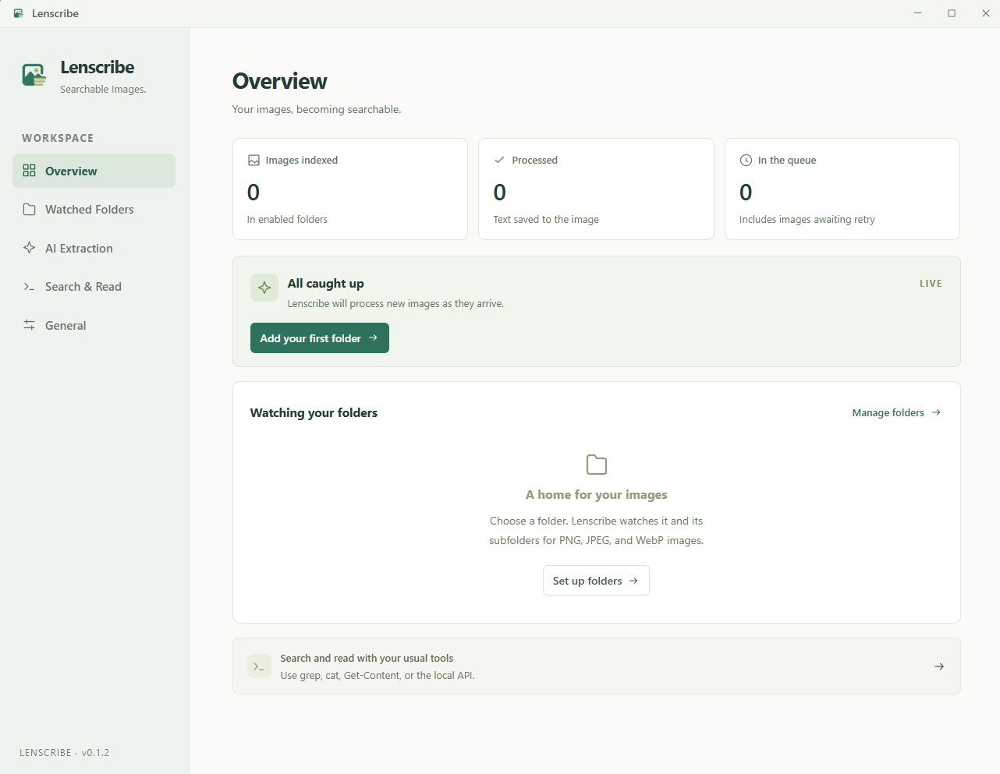

<p align="center">
  
</p>

<h1 align="center">Lenscribe</h1>

<p align="center">
  <strong>Make your images searchable with the tools you already use.</strong>
</p>

<p align="center">Lenscribe watches your folders, uses a vision model to extract text from your images, and saves it <strong>inside each image file</strong>. The text stays with the image, so you can search and read it with familiar tools like <code>grep</code>, <code>cat</code>, and PowerShell's <code>Get-Content</code>, or access it through a local API with <code>curl</code>.</p>

<p align="center">
  <a href="https://github.com/ssubedir/lenscribe/releases/latest">
    
  </a>
  <a href="https://github.com/ssubedir/lenscribe/actions/workflows/ci.yml">
    
  </a>
  <a href="#install">
    
  </a>
</p>

<p align="center"><a href="https://github.com/ssubedir/lenscribe/releases">Download</a> · <a href="#getting-started">Getting started</a> · <a href="#search-your-images">Search your images</a> · <a href="#development">Development</a> · <a href="https://github.com/ssubedir/lenscribe/issues">Report an issue</a></p>

<p align="center">
  
</p>

---

## What it does

- **Watches folders and subfolders** for PNG, JPEG, and WebP files.
- **Extracts readable text** with a hosted or local vision model.
- **Keeps text with the image** as an appended UTF-8 trailer, preserving the original image bytes.
- **Reuses extraction results** for matching image hashes and model settings.
- **Tracks changes with a Merkle tree** and stores its local index, queue, and cache in WeDB.
- **Recovers pending work across restarts**, with retries, concurrency controls, and request rate limits.
- **Lets you inspect, edit, and reprocess files** from the settings window.
- **Keeps search and recovery local** with fuzzy matching, database backups, index rebuilds, and cache cleanup.
- **Fits into a desktop workflow** with a system tray, start at login, and light/dark themes.
- **Checks for signed updates** in the background and installs them when you choose.

## Install

Download a package for your platform from [GitHub Releases](https://github.com/ssubedir/lenscribe/releases).

| Platform            | Packages built by the release workflow |
| ------------------- | -------------------------------------- |
| Windows x64         | Setup `.exe` and `.msi`                |
| Linux x64           | `.deb` and `.AppImage`                 |
| macOS Apple Silicon | `.dmg`                                 |
| macOS Intel         | `.dmg`                                 |

Windows installers are currently unsigned. macOS builds use ad-hoc signing and are not notarized. See the [release guide](docs/development.md#releases) for the current signing setup.

This README describes the source tree. To use changes added since the latest release, [run or build from source](#development). Installed release builds check for stable updates in the background. Use **General → App Updates** to check manually or update and restart; a sidebar notice appears when an update is available. Linux in-app updates are enabled for AppImage installations; update `.deb` packages through your package manager. Older builds without these controls can still use the release installers.

## Getting started

1. Open **Watched Folders**, choose a folder, and save your changes. Subfolders are included. Use **Folder Rules** to exclude paths or set a size limit.
2. Open **AI Extraction** and choose your provider.
3. Select an image-capable model with **Fetch Models**, or enter its exact model ID manually. Enter an API key when your provider requires one.
4. Enable **Automatic text extraction** and save. Lenscribe processes pending images and watches for new arrivals.
5. Use **Overview** to see progress, or **Watched Folders → Inspect Files** to search filenames and extracted text, preview an image, edit its text, and retry or reprocess it. Search also finds word prefixes and common typos automatically.

Automatic extraction is off until you enable it. Scanning by itself indexes files and existing text without sending images to a model.

You can close the settings window while processing continues. Reopen it from the system tray, or choose **Quit Lenscribe** there to stop the app. **General** contains pause/resume, startup, appearance settings, and **Index & Cache** maintenance tools.

### Supported providers

| Provider                   | Connection setup                                           |
| -------------------------- | ---------------------------------------------------------- |
| OpenAI                     | API key and an image-capable model                         |
| Anthropic                  | API key and an image-capable Claude model                  |
| Google Gemini              | API key and an image-capable Gemini model                  |
| OpenRouter                 | API key and an image-capable model from its catalog        |
| Groq                       | API key and an image-capable model                         |
| xAI                        | API key and an image-capable Grok model                    |
| Ollama                     | Server URL and an installed vision model; API key optional |
| Custom / OpenAI Compatible | Base URL and model ID; API key optional                    |

**Base URL** appears only for Ollama and Custom / OpenAI Compatible. Ollama defaults to `http://localhost:11434`; custom endpoints default to `http://localhost:1234/v1`. Enter the base URL without the chat or generation endpoint. Hosted providers use their preset URLs.

Each provider remembers its own saved connection. Switching providers restores its model, credentials, and editable URL. Model availability and supported image formats depend on the selected provider and model; an unverified catalog entry is not a guarantee of image support.

**Extraction options** lets you change the prompt, token limit, timeout, concurrent images (1–8), and requests per minute (0–600; `0` is unlimited). Changing settings affects pending work. Use **Reprocess** for a fresh request on an already processed image.

## Search your images

### Use your files directly

The appended text is readable without Lenscribe running.

Search an image for “coffee” on Linux, macOS, or Git Bash:

```sh
grep -a "coffee" "/path/to/image.webp"
```

The `-a` option lets `grep` read the image as text.

Read the file with `cat`:

```sh
cat "/path/to/image.webp"
```

Or read it in PowerShell:

```powershell
Get-Content "C:/path/to/image.webp" -Encoding utf8
```

These commands read the whole file, including image bytes and trailer markers. Use the API below when you want **only the extracted text**. The **Search & Read** settings page includes copyable examples.

### Use the local API

Enable **Search & Read → Local search API** and save. The default address is `http://127.0.0.1:47831`; setting the port to `0` chooses an available port.

```sh
# Search filenames and extracted text.
curl -G --data-urlencode "q=coffee" "http://127.0.0.1:47831/search"

# Read the text for a file ID returned by search.
curl "http://127.0.0.1:47831/files/1/text"
```

In Windows PowerShell, use `curl.exe` to call the curl executable explicitly.

| Endpoint               | Returns                                            |
| ---------------------- | -------------------------------------------------- |
| `GET /health`          | Readiness and version                              |
| `GET /folders`         | Indexed folders                                    |
| `GET /folders/:id`     | Folder details, files, and Merkle root             |
| `GET /files/:id`       | File details and extracted text                    |
| `GET /files/:id/text`  | Extracted text as plain UTF-8                      |
| `GET /search?q=…`      | Ranked matches with snippets                       |
| `GET /search/page?q=…` | Matches, snippets, total count, and search notices |

Search uses the same filename and extracted-text matching as the file inspector, including word prefixes and common typos. Exact filename matches come first, then exact text matches, then fuzzy matches. Query words are treated as text, not search operators. If fuzzy expansion exceeds its limits, search returns exact matches with a notice in `/search/page`.

Both search endpoints accept optional `folderId`, `offset`, and `limit` parameters, up to 100 results per page. Set `fuzzy=false` for literal substring matching. `/search` returns an array; `/search/page` returns `hits`, `total`, `fuzzyApplied`, and `notice`. For example:

```sh
curl -G --data-urlencode "q=cofee" --data-urlencode "offset=20" --data-urlencode "limit=20" "http://127.0.0.1:47831/search/page"
```

The API runs while Lenscribe is open in the background. It is read-only, binds to IPv4 loopback, has no authentication, and does not enable browser CORS. Other processes on your computer can query it when enabled.

## Maintain your index

Open **General → Index & Cache** to use these tools:

- **Export Backup** saves a checksummed Lenscribe backup of file records, cached extractions, queued work, saved responses, and recovery state while the app is running. Choose a new filename; existing files are not overwritten. Back up your images and `settings.json` separately.
- **Rebuild Index** scans known folders, imports their embedded text, and rebuilds search. It reports unavailable folders and preserves their existing records. Rebuilding does not modify images or call a model; if automatic extraction is enabled, newly discovered pending images enter its normal queue.
- **Clear Unused Cache** removes cached extractions that no indexed image currently references. This clears reuse history for removed images or older extraction settings; embedded text and current file records remain in place.

WeDB stores the index, extraction cache, and durable queue in `index.wedb`. See [storage and backups](docs/development.md#storage-and-backups) for backup and recovery details.

WeDB stores the durable extraction queue. Workers claim bounded batches of ready jobs, honor persisted retries, and briefly defer images that are locked or still changing. Successful model responses are synced before writing their image trailers, so interrupted writes can resume without another model request. Before extraction, an image must have stable size and modification time for one second; the existing hash check rejects stale jobs and prevents committing results to changed images.

## How the text stays with the image

Lenscribe uses **end-of-file (EOF) steganography**: it stores extracted text after the original image data, leaving the visible image unchanged. It appends a small header, the raw UTF-8 transcription, and a checksummed footer without re-encoding the image. Processing the same file again replaces Lenscribe's own trailer.

The text is intentionally readable and unencrypted, so ordinary file tools can search it. This is the [appended-data approach to steganography](https://www.trinitycyber.com/hubfs/appended-data.pdf).

The original bytes have a SHA-256 hash. That hash and the extraction settings identify reusable results, while a directory Merkle tree tracks changes to filenames, image content, and saved text. WeDB stores the canonical records. Local search indexes are rebuilt from those records at startup without calling a model, and scans can import trailers from processed files.

Compatibility depends on image readers tolerating trailing data. Re-saving or re-encoding an image in another application may discard its appended text. PNG and WebP decoding are covered by tests; JPEG byte preservation is tested. See [architecture and file format](docs/architecture.md) for the details.

## Data and privacy

- Images are sent to the provider you select **only when extraction is enabled**. Requests contain the original image bytes, excluding Lenscribe's appended text.
- A local Ollama or compatible endpoint can keep model processing on your machine. Hosted providers receive images under their own service terms.
- API keys are stored **as plain text** in local `settings.json`. No environment variables are needed.
- The local database stores filenames, extracted text, cached results, and processing state. The image itself also contains its extracted text; copying it copies that text too.
- Desktop logs include diagnostic file paths, but exclude API keys, prompts, image payloads, extracted text, and raw model request/response bodies.

Configuration and the database live in Tauri's application data directory. Log locations and troubleshooting steps are in the [development guide](docs/development.md#logs-and-troubleshooting).

### Current limits

Automatic extraction and previews are limited to **20 MiB per image**. Oversized or failed images remain pending with an error. A folder's size limit controls indexing separately.

Text extraction can make mistakes. Inspect or edit the result when accuracy matters. Animated WebP bytes are preserved, but the vision model determines how it interprets animation. See [processing behavior](docs/architecture.md#extraction-and-recovery) for retries, duplicate handling, and protection against stale results.

## Development

The app uses **Tauri 2**, **Svelte/TypeScript**, and a **Rust core**. Install [Bun](https://bun.sh/docs/installation) (the version in `package.json`), [stable Rust](https://rust-lang.org/tools/install/), and the [Tauri prerequisites for your OS](https://v2.tauri.app/start/prerequisites/).

```sh
git clone https://github.com/ssubedir/lenscribe.git
cd scribe
bun install --frozen-lockfile
bun run tauri dev
```

For UI work with sample data, run `bun run dev` and open `http://127.0.0.1:1420/?preview`. This development-only preview uses in-memory fixtures; it does not watch real folders, call a provider, or save desktop settings.

For release builds and installer signing, see the development guide below.

- [Development guide](docs/development.md): prerequisites, checks, headless runner, logs, and releases.
- [Architecture](docs/architecture.md): code layout, generated types, image trailers, Merkle tracking, and extraction.
- [Issues](https://github.com/ssubedir/lenscribe/issues): bugs and feature requests.

For a bug report, include your OS, Lenscribe version, steps to reproduce, and the relevant sanitized log lines. Keep API keys and private image/text content out of the report.

## Community

[Contributing](CONTRIBUTING.md) · [Code of Conduct](CODE_OF_CONDUCT.md) · [Security Policy](SECURITY.md)
