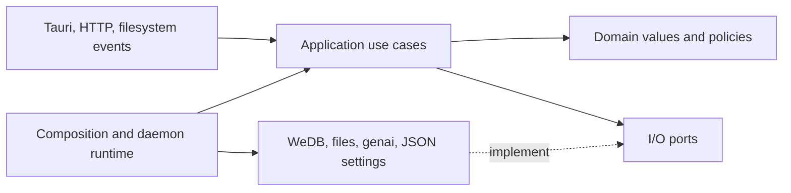

# Architecture

[Back to the README](../README.md)

Lenscribe is one desktop process with a Rust engine and a Svelte settings window. The engine owns folder watching, extraction, and the optional local HTTP API. Closing or destroying the settings page does not stop that work.

## Code layout

| Path | Responsibility |
| --- | --- |
| `src-tauri/crates/src/domain/` | Image and folder identities, Merkle trees, folder rules, configuration values, and search matching policies |
| `src-tauri/crates/src/application/core.rs` | Index, search, image preparation, text editing, and extraction commit use cases |
| `src-tauri/crates/src/application/scan.rs` | Scan state and incremental reconciliation through image and repository ports |
| `src-tauri/crates/src/application/extraction.rs` | Concurrent extraction, cancellation, pacing, retries, and response recovery |
| `src-tauri/crates/src/application/maintenance.rs` | Backup, trailer re-import, search rebuild, and cache cleanup workflows |
| `src-tauri/crates/src/ports/` | Repository, image filesystem, vision provider, settings store, and watcher contracts |
| `src-tauri/crates/src/adapters/wedb/` | Durable repository implementation, atomic batches, projections, backups, and legacy import |
| `src-tauri/crates/src/adapters/filesystem/` | Safe paths, lazy traversal, image trailer I/O, JSON settings, and native watcher implementation |
| `src-tauri/crates/src/adapters/llm.rs` | Vision provider adapter through `genai` and completion validation |
| `src-tauri/crates/src/adapters/llm/connection.rs` | Bounded provider model discovery |
| `src-tauri/crates/src/adapters/http.rs` | Read-only loopback transport calling application use cases |
| `src-tauri/crates/src/runtime/daemon.rs` | Background lifecycle and settings, extraction, watcher, and HTTP coordination |
| `src-tauri/crates/src/composition.rs` | Default adapter wiring for desktop and headless entry points |
| `src-tauri/crates/src/lib.rs` | Public exports, including compatibility aliases for existing callers |
| `src-tauri/crates/migrations/` | Legacy SQLite schemas used by migration fixtures |
| `src-tauri/src/commands.rs` | Tauri adapters; file work runs off the UI thread |
| `src/lib/core.ts` | Typed Tauri command and event wrappers |
| `src/lib/clients/` | Desktop, updater, and isolated preview adapters |
| `src/lib/settings/controller.svelte.ts` | Live status, editable drafts, validation, and Save/Discard |
| `src/lib/components/settings/` | Settings screens |
| `src/lib/components/FileInspector.svelte` | Image preview, text editing, and reprocessing |
| `src/lib/styles/` | Shared typography, controls, and layout |

Rust's serialized DTOs are the source of truth for `src/lib/generated/core.ts`, generated through [ts-rs](https://github.com/Aleph-Alpha/ts-rs). After changing a DTO, run `bun run types:generate`. `bun run check` verifies the contract before checking Svelte. Do not edit generated bindings manually.

### Ports and adapters

The domain contains business values and policies without filesystem, database, or network operations. Application services orchestrate those values through ports. Concrete adapters depend inward on those contracts. The outer daemon runtime coordinates long-lived tasks and the optional HTTP transport. Default constructors are wired in `composition.rs`; the application layer does not construct WeDB, `genai`, or native watcher instances.



`Core::new` accepts the index repository, image filesystem, watcher, and vision factory. `Daemon::new` accepts a settings store. `Core::open` and `Daemon::load` provide the existing default wiring. Image traversal remains lazy, excluded directories are pruned by the filesystem adapter, and path safety is enforced there before image reads and writes. Settings values validate syntax and policies in the domain; the JSON adapter also checks canonical folder aliases when loading or saving.

The index port separates catalog, extraction queue, recovery, and maintenance capabilities, but one repository instance owns them all. Scans and response/failure updates retain their atomic commits and the core's existing serialization lock. Ports expose those operations rather than WeDB keys or generic database transactions. A replacement repository must preserve the same durability and generation checks.

Add new business policies to `domain`, workflows to `application`, and external integrations to `adapters`. Keep concrete wiring in `composition` or `runtime`. The adapter-injection tests exercise background processing with an in-memory settings store and a fake vision provider, plus image-write failure recovery through a replaced filesystem port.

Canonical storage uses a versioned Lenscribe keyspace in WeDB. An unsupported schema is rejected. The one-time importer reads a consistent SQLite transaction, preserves IDs, text, cache, queue generations, retries, and Merkle roots, validates references and hashes, then commits the imported records and schema marker together. It never updates or removes the original SQLite database. The default `legacy-sqlite` feature supplies this reader; `--no-default-features` builds the core without SQLite. Existing data requiring migration is rejected when that feature is absent.

The storage facade sits behind the core mutex, which serializes mutations including read/modify/write operations. Repositories expose application operations such as file lookup, queue claims, response saving, and failure recording. Canonical records use an application-owned keyspace rather than WeDB internal Redis encodings. A scan batches file records, immutable text bodies, cache pointers, stale-job cleanup, Merkle checkpoints, and the folder root atomically. Failure records and endpoint state also share a batch. Each critical batch is followed by `persist()` (Fjall `SyncAll`); projections become visible only after that sync succeeds. A failed sync stops further writes until reopening.

The desktop profile budgets 32 MiB for the block cache, 8 MiB for data memtables, 4 MiB for metadata memtables, 128 MiB for journal rotation, and two background workers. These are storage budgets, not a total RAM limit: metadata, queue projections, search postings, and transient operations also use memory. Fjall holds an exclusive database lock. Graceful daemon shutdown waits for extraction and API tasks and performs a final sync. Tauri, HTTP, and TypeScript contracts remain stable, and existing Rust module paths and facade methods remain available. Watcher and legacy database errors now carry messages instead of concrete adapter error types, keeping the shared error contract independent of `notify` and `rusqlite`.

### Canonical key layout

`wedb_embed` is pinned to `0.1.13` with its Fjall backend. Lenscribe uses the `lenscribe-v1` partition and schema version 1. Positive IDs are zero-padded to 20 digits; immutable text is addressed by its SHA-256 hash.

| Key prefix                | Value                                                     |
| ------------------------- | --------------------------------------------------------- |
| `schema`, `seq/`          | Schema version and allocated folder/file/job IDs          |
| `folders/`, `files/`      | Folder roots and per-file metadata                        |
| `texts/`                  | Immutable extracted text bodies                           |
| `cache/`                  | Image and processor identity pointing to a text hash      |
| `jobs/`                   | Request generation, force flag, readiness time, and lease |
| `results/`                | Saved response and expected image/record/request identity |
| `failures/`, `endpoints/` | Per-file retries and provider backoff/pacing              |
| `merkle/`                 | Directory checkpoints for each folder                     |

Metadata, ready/deadline queues, vocabulary, and search postings are derived projections. Queue projections are retained only for the current provider recovery identity and rebuilt when it changes. Text bodies are fetched from storage for result pages and edits. Later embedding support can use the same immutable body identity without changing file identity or the trailer format.

### Scale and recovery validation

The ignored `adapters::wedb::database::tests::storage_scaling_probe` exercises 10,000 and 100,000 records. Set `LENSCRIBE_BENCH_FILES` to choose the count, then run:

```sh
cargo test --manifest-path src-tauri/Cargo.toml -p lenscribe-core --all-features --lib storage_scaling_probe -- --ignored --nocapture
```

Windows x64 debug measurements on October 5, 2026:

| Files | Synced scan batch | Literal search page | Fuzzy search page | Ready 8 jobs, warm | Reopen and rebuild search | Sampled peak private memory |
| --- | --- | --- | --- | --- | --- | --- |
| 10,000 | 1.46 s | 26 ms | 34 ms | 5 µs | 1.54 s | 78.4 MiB |
| 100,000 | 25.23 s | 780 ms | 1.04 s | 12 µs | 16.33 s | 719.1 MiB |

These are regression probes, not production benchmarks or a total memory guarantee. Every synthetic record has a unique image hash and a distinct filename, but shares one short transcription to exercise deduplication. Searches return 50 snippets and count all matches; reopening excludes filesystem hashing and scans. Warm queue measurements exclude the initial projection build. Peak memory is sampled across the entire test process, including fixture vectors, two stores, transient batches, search projections, and the SQLite comparison. Larger unique transcriptions need additional memory. Background compilation was running during this sample; release builds and other machines need separate measurements.

The SQLite fixture uses WAL with full sync and the previous FTS triggers/cache writes. Its 10,000/100,000-record batches took 1.12/21.20 seconds; literal count-only queries took 11/129 ms. It does not implement the same fuzzy, ranking, pagination, or snippet workload, so these numbers do not establish an overall speed advantage for either implementation. Search rebuild time and peak memory remain the main large-library limitations of the current WeDB integration.

Tests also kill a subprocess after a synced response, reclaim its abandoned lease, reconcile a trailer written before acknowledgement, inject an uncertain sync failure, reject inconsistent backups, verify migration source preservation, and exercise live watchers and locked Windows files. CI checks both the default migration-enabled build and the SQLite-free core across the native platform matrix; cross-platform runs must be started manually.

## Image trailer format

PNG, JPEG, and WebP are identified by their file signatures. The scanner does not fully decode every image. Extensions are matched without case sensitivity. WebP detection checks the RIFF/WEBP header and that the declared container fits inside the original bytes.

V1 stores the following without recompressing the image or text:

```text
[all original file bytes]
LENSCRIBE-TEXT-V1
{"imageHash":"<SHA-256 hex>","processor":"<provider/model/settings version>"}
[raw UTF-8 text]
LENSCRIBE-END-V1 <image length> <payload length> <payload SHA-256 hex>
```

Both markers begin with a newline. The payload is exactly `JSON header + newline + text`. The footer ends with a newline. Lengths are 20-digit, zero-padded decimal byte counts; hashes are 64 lowercase hex characters.

The fixed-size ASCII footer locates the payload without scanning image data for markers. Reads validate lengths, the payload checksum, and the original image hash. Marker strings inside the transcription cannot change its boundaries.

Writes use a synchronized temporary file in the same directory and an atomic replacement. Identical writes do nothing. Only Lenscribe's own trailer is replaced; unmarked trailing data remains part of the original file. Expected image and record hashes prevent stale results or edits from replacing a newer image or manual correction.

Limits are 16 MiB of extracted text, 4096 bytes for the processor identifier, and 128 MiB of original bytes through the core preparation API. The desktop's vision client and previews apply the lower 20 MiB limit.

WebP's original RIFF size remains unchanged, including for lossy, lossless, transparent, and animated files. Text follows that container. [WebP readers may ignore trailing data](https://developers.google.com/speed/webp/docs/riff_container#webp_file_header); compatibility still depends on the reader. Tests decode processed PNG/WebP files and compare WebP pixels, alpha, and animation frames. JPEG tests verify the original bytes remain unchanged.

## Merkle tracking and watching

Image identity is SHA-256 of every byte before the Lenscribe trailer. A file record commits to image hash, extracted-text hash, and processor identity. A pending file differs from a successfully processed file with empty text.

Directory nodes hash sorted `(child name, node kind, child hash)` entries with UTF-8 byte ordering, length-prefixed fields, and distinct versioned prefixes. Absolute paths, timestamps, empty directories, the database, and the stored root are excluded. Equal relative image trees have equal roots in different locations. Renames change roots while preserving image identity.

The scanner keeps file metadata and the tree in memory. Changed directory checkpoints are persisted with canonical file records and the root. Checkpoints are validated against file records at startup; missing or inconsistent checkpoints are rebuilt. Startup still verifies image hashes, so a checkpoint never substitutes for checking offline filesystem changes. Watch events reconcile affected files or directory subtrees and update their ancestors. Text writes update one image's index entry. Events coalesce after 500 ms of quiet, with a 2-second maximum delay and at most 1024 retained paths. Overflow, unknown event paths, and watcher rescan notices request a full scan.

A 30-second metadata reconciliation catches changes in names, sizes, and modification times without rereading unchanged images. Startup and explicit scans verify hashes. A missed write that preserves both size and modification time can escape metadata reconciliation until a full scan. Unchanged scans do not rewrite indexed records.

Folder Rules apply to scanning, extraction preparation, and commits. Exclusion patterns use `/`, match without case sensitivity on Windows, and cannot escape the watched folder. Bare filenames match at every depth. Excluded files leave the index and queue without modifying their image or text; including them again imports existing trailers.

Invalid files are reported as scan issues and excluded from the index. Transient read errors, including Windows sharing locks, retain existing file records and Merkle entries until a later scan can read the image. Directory traversal failures abort a scan instead of silently pruning an inaccessible subtree. Symbolic links are not followed.

## Extraction and recovery

WeDB is the durable queue. Rebuildable ready sets and deadline sets select only enough jobs to fill free worker slots, excluding active files, future retries, and permanent failures for the current provider configuration. Durable leases prevent duplicate claims and are reclaimed on reopening after the previous process exits. Mutations notify the worker; otherwise it waits for completion or the next deadline with a 30-second reconciliation fallback. Forced jobs take priority. Concurrency defaults to one image and is bounded to 1–8. Requests per minute are bounded to 0–600, where zero is unrestricted. Request starts are evenly paced across workers; cache hits do not consume requests.

Before reading an image for extraction, the worker observes its size and modification time every 250 ms and requires one second of stability. A readiness check lasts at most five seconds. Images that remain unstable or locked are deferred for two seconds in WeDB, so they cannot monopolize the queue indefinitely. Deferrals preserve retry attempts and survive restarts. The image hash must still match the queued record after preparation, and commits retain their existing hash and request identity guards. Stability checks do not fully decode images or guarantee that a writer has finished after an unusually long pause.

The persistent cache key combines the original image SHA-256 with a processor identifier containing the provider, model, endpoint, prompt, token limit, and extraction-format version. API keys and runtime pacing limits are excluded from this identity. Identical pending images share one in-flight request. Successful empty text is reusable. Manually edited text has a separate `manual/v1` identity. Forced reprocessing bypasses older reusable results while retaining its own saved response for write recovery. Extracted text bodies are immutable and addressed by SHA-256; file records and cache entries reference those bodies independently, so editing one image never changes another image with identical original bytes.

Processing follows queued → leased → response saved → trailer written → complete. The response, cache pointer, and write intent are synced before modifying the image. Locked files and restarts reuse the saved response. A startup scan acknowledges an interrupted commit only when that generation's saved result exactly matches the image trailer. File writes and database batches are separate transactions; hash and generation guards reconcile them. Execution is at least once: a crash before the response is saved can require another model request.

Only the original image bytes are sent to the vision model. The default prompt requests transcription in the original language and treats visible instructions as text. Valid empty text counts as processed. Truncated, filtered, refused, missing, or malformed responses leave the file unchanged and pending.

Rate limits, timeouts, and server errors retry with exponential backoff, up to five attempts per image, honoring numeric `Retry-After` headers. Attempt counts, sanitized errors, retry times, endpoint backoff, and pacing persist in WeDB. Authentication or endpoint errors block requests until configuration changes or an explicit retry. Changing the API key creates a new recovery state without invalidating cached extraction results.

Global **Retry extraction** resets failures and backoff while retaining pacing. Retrying a single file leaves other failures alone. **Reprocess** records a durable forced job; existing text stays readable until a fresh response succeeds. Older in-flight results cannot overwrite an updated image or manual edit.

Pausing stops watches and extraction, cancels in-flight requests, and keeps the backlog. Resuming scans for changes. Changing extraction settings or removing or disabling a folder cancels the previous worker before applying responses.

### Provider routing and discovery

Routing is explicit: a model name cannot select a different service.

| Provider value | Preset base URL | Request endpoint |
| --- | --- | --- |
| `openai` | `https://api.openai.com/v1` | `/chat/completions` |
| `anthropic` | `https://api.anthropic.com/v1` | `/messages` |
| `gemini` | `https://generativelanguage.googleapis.com/v1beta` | `/models/<model>:generateContent` |
| `openRouter` | `https://openrouter.ai/api/v1` | `/chat/completions` |
| `ollama` | `http://localhost:11434` | `/api/chat` |
| `groq` | `https://api.groq.com/openai/v1` | `/chat/completions` |
| `xai` | `https://api.x.ai/v1` | `/chat/completions` |
| `custom` | `http://localhost:1234/v1` | `/chat/completions` |

Anthropic, Gemini, and Ollama use native image protocols; the remaining providers use Chat Completions. Gemini accepts model IDs with or without `models/`. Hosted presets are applied by the settings UI; hand-written JSON must also supply the matching `baseUrl`.

Fetch Models requests provider catalogs or installed Ollama models, excludes models explicitly marked as text-only, and keeps entries with unknown image support marked as unverified. Catalogs are bounded to 500 entries and 10 pages. Manual model IDs remain available if discovery is unavailable.

## Search and frontend boundaries

The file inspector and HTTP API share one WeDB-backed search repository. WeDB's in-memory inverted index is rebuilt from canonical file records at startup. Shared text bodies are indexed once with a reverse mapping to files; filenames have separate documents. Unicode case and diacritic normalization is applied before indexing, and Lenscribe supplies ranking, bounded fuzzy expansion, pagination, and snippets. Search combines literal substrings in filenames and extracted text with automatic fuzzy matching, adding indexed word prefixes and up to one insertion, deletion, substitution, or adjacent swap for words of four or more characters. All query words must match the same file; exact filename matches precede exact text matches, followed by fuzzy matches. Results are ordered consistently by relative path, folder, and file ID within each rank. The inspector uses 50 results per page; the API accepts `offset` and a `limit` up to 100. `/search` retains its array response, while `/search/page` includes hits, total count, fuzzy status, and a fallback notice. Snippets are generated only for the current page. The HTTP layer runs blocking database operations off the async request thread. Its plain-text endpoint returns 404 when text is missing.

An ordered vocabulary follows the derived index, so edits, scans, and removals immediately affect searches without another persistent engine or model requests. Fuzzy queries support up to eight words of 64 characters each, scan at most 50,000 candidate dictionary words, and expand each word to at most 32 alternatives. When word or vocabulary limits are exceeded, matching falls back to exact AND terms and literal substrings with a notice. Inspector queries are limited to 1024 bytes and API queries to 4096 bytes. API callers can set `fuzzy=false` for literal substring matching. Semantic search and embeddings are not included.

## Maintenance

Backup exports a versioned JSON envelope with a SHA-256 checksum and all canonical records to a temporary file beside the chosen destination. The core database mutex keeps the logical export consistent; it does not copy a live LSM directory. The completed file is synced and published without overwriting an existing destination. Backups include the index, cached text, queue, and recovery state; images and settings are separate. `Core::restore_database(backup, new_directory)` validates the envelope, schema, references, IDs, and text hashes before restoring to a new directory; derived indexes are rebuilt. Existing destinations are rejected. No restore UI is included.

Rebuilding refreshes the derived search index, scans known folders with their normal rules, re-imports current trailers, and rebuilds search again. Unavailable folders retain their existing records and produce per-folder issues. Scans and cache cleanup use the core's write serialization lock. Cache cleanup deletes only cache pointers whose image hash and processor are no longer referenced by indexed files. Text bodies still referenced by files or saved responses are retained. It never modifies images or their trailers.

The settings controller keeps live status separate from the editable draft. Polling cannot erase unsaved changes. Save applies configuration in Rust; Discard restores saved settings. Aggregate progress uses the canonical metadata projection, including successful empty transcriptions.

The preview adapter is loaded only in explicit development preview mode. Its files, edits, images, and settings stay in memory. Native dialogs, command invocations, and model requests belong to the desktop adapter.

Tauri watch events use `lenscribe://watch` with typed updated reports or failures. Command wrappers are in `src/lib/core.ts`; unsubscribe from events when a component is destroyed. The daemon owns its lifecycle independently of that page.
